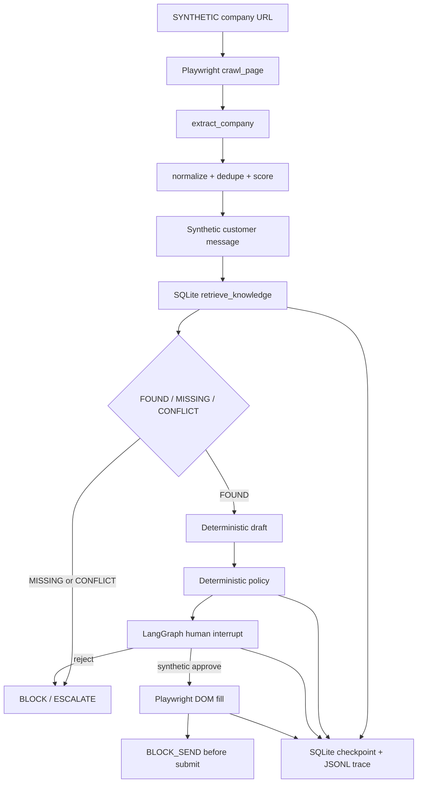

# 开源组合架构

## 1. 两套可选架构

| 维度 | 架构 A：轻量可组合（唯一推荐） | 架构 B：平台中心（本轮拒绝） |
|---|---|---|
| 网页/DOM | Playwright + `WebAdapter` | Crawl4AI/Firecrawl + 浏览器平台 |
| 清洗 | Python 纯函数；未来 dedupe/Splink | 平台内 ETL/表格节点 |
| 知识 | SQLite 结构化事实；未来 pgvector/Haystack | Dify/RAGFlow/AnythingLLM |
| Agent | LangGraph OSS 最小 StateGraph | Dify/Flowise/Langflow 平台流程 |
| Runtime | LangGraph SQLite checkpointer + 业务 SQLite | n8n/Temporal/平台数据库 |
| 审批/CRM | 当前合成 interrupt；未来独立 Adapter | Chatwoot/Twenty/Baserow 平台 |
| Trace | JSONL；未来 OpenTelemetry | Langfuse/Phoenix 平台 |
| 优点 | 无 key、本地可测、替换成本低、边界可审计 | UI 丰富、连接器多、适合成熟团队 |
| 代价 | 需要维护少量业务胶水 | 多服务、mixed license、secret/数据面、第二事实源、升级复杂 |
| 决定 | `adopt` | `reject_for_pilot` |

推荐 A 的直接原因：本轮必须真实验证浏览器、知识、政策、人工中断和 checkpoint，但不需要真正 CRM、向量库、营销发送或平台 UI。A 恰好覆盖要求，B 会先引入最昂贵的运维与许可证问题。

## 2. 十层组合

| 层 | 当前实现 | 未来替换点 | 本轮状态 |
|---|---|---|---|
| 1 网页获取 | `PlaywrightWebAdapter.crawl_page` | Trafilatura/Scrapy/Crawlee/Crawl4AI Adapter | localhost 已验证 |
| 2 DOM 交互 | label/test-id locator；填入不提交 | 平台专属 DOM Adapter | localhost 已验证 |
| 3 清洗结构化 | normalize/dedupe/score 纯函数 | dedupe/Splink | 合成数据已验证 |
| 4 知识事实 | SQLite 结构化记录 | Postgres/对象存储 | 合成知识已验证 |
| 5 资料召回 | token 交集 + 来源/冲突 | Haystack/LlamaIndex/pgvector | 小规模已验证 |
| 6 对话智能体 | 确定性 Draft Fixture | 受控 ModelAdapter | 只生成草稿 |
| 7 政策闸门 | `DeterministicPolicyGate` | 版本化规则引擎 | 已验证，模型不可覆盖 |
| 8 LangGraph | State/Edge/interrupt/resume | 兼容状态图 | 已验证 |
| 9 Runtime | SQLite checkpoint/events | Temporal/Postgres | 单机重开已验证 |
| 10 可观测 | JSONL Trace | OpenTelemetry | 节点记录已验证 |

## 3. 数据与控制流

控制面始终优先于模型面：知识状态、政策结果、人工决定和 `BLOCK_SEND` 是硬条件；未来 ModelAdapter 只能产生候选意图/草稿，不能修改权限。

## 4. 统一 Adapter 与替换成本

- `WebAdapter`：网页引擎变化不影响 graph。
- `KnowledgeAdapter`：SQLite 可换 Haystack/pgvector，但返回字段不变。
- `RuntimeAdapter`：SQLite 可换 Temporal/Postgres，保留 `save/resume/stop`。
- Policy/Draft：来源和状态契约稳定；模型只是可替换候选生成器。
- Trace：JSONL 可以单向映射为 OpenTelemetry span，不要求业务节点理解平台 SDK。

## 5. 安全、回滚和退出

- URL 默认只允许 `127.0.0.1/localhost/::1`；生产 allowlist 尚未设计，不存在“临时放开”。
- `submit_message` 只有 Fake 阻断实现；删除代码也不会产生真实发送能力。
- 运行数据位于被忽略的 `runtime_data/`；回滚可删除该目录并重建，无正式客户数据。
- 依赖升级失败：恢复 `pyproject.toml`/`requirements.lock` 的精确版本，重建 venv。
- LangGraph 替换：保留 ConversationState/Adapter，迁移 checkpoint；不直接把 checkpointer 表当业务事实。
- 本地仓库可独立删除，不影响 `dami` current；工具仓库也不能反向覆盖业务事实。

## 6. 工程深度说明

任务使用 L3 是因为同时存在 10 层、状态、人工中断、checkpoint、失败路由和未来长期价值；实现仍刻意轻量。没有构建 CRM、RAG 平台、模型网关、消息通道或生产部署，这些是未来闸门后的独立工作。
